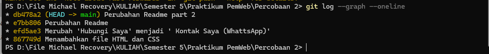

Praktikum-Pemrograman-Web

Perkanalkan Saya Michael Deffrans Cristian NPM : 2315061087 Kelompok Praktikum : PW- A

Ini merupakan Tugas Akhir Praktikum Pemrograman Web judul 2 :

<h2>Website Profile ini merupakan Website Protofilo sederhana dari Diri saya sendiri yang mencakup : </h2>

<li> 1. Header (profile) : Berisikan Foto, Nama dan Info Kontak, dll </li>
<li> 2. Proyek Saya : Daftar proyek yang pernah saya lakukan / buat </li>
<li> 3. Pengalaman Organisasi : Daftar organisasi yang pernah saya ikuti selama berkuliah. </li>
<li> 4. Prestasi : Daftar prestasi yang pernah saya raih. </li>
  

Pada tugas akhir kali ini saya menggunakan beberapa perintah yaitu : 
1. git init : untuk inisialisasi awal
2. git add : untuk menambahkan perubahan baru 
3. git commit : untuk melakukan commit perubahan baru serta meninggalkan pesan perubahan 
4. git branch #nama branch# , git checkout #nama branch# : untuk menambahkan dan pindah ke branch yang sudah dibuat 
5. git merge : untuk menyatukan perubahan dari branch lain ke branch 'master'. 

Sekian Terimakasih

